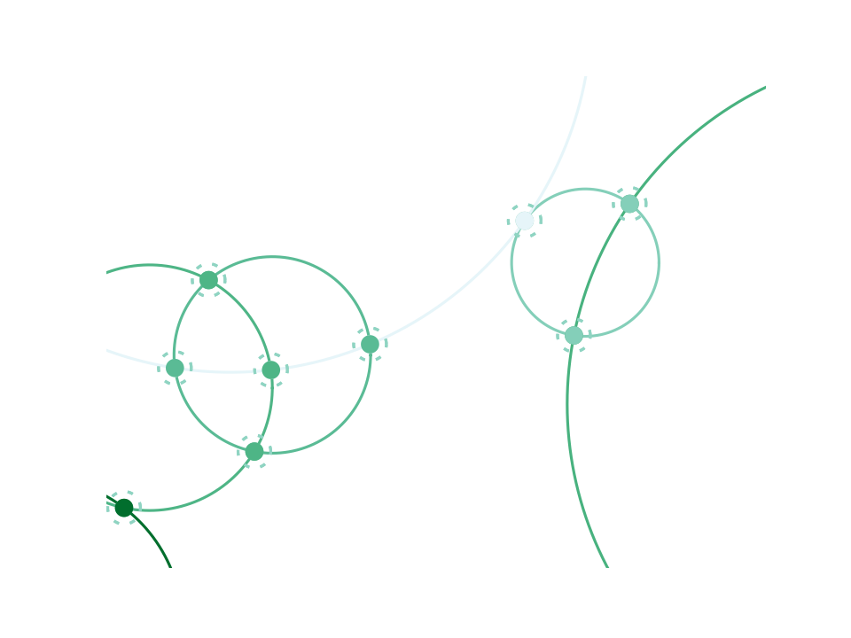

# Random Circles

Plots an interconnected net of circles with some dashed circles in the intersections.

## Run

'''python create_circles.py'''

## Examples

based on https://stackoverflow.com/questions/15445546/finding-intersection-points-of-two-ellipses-python
